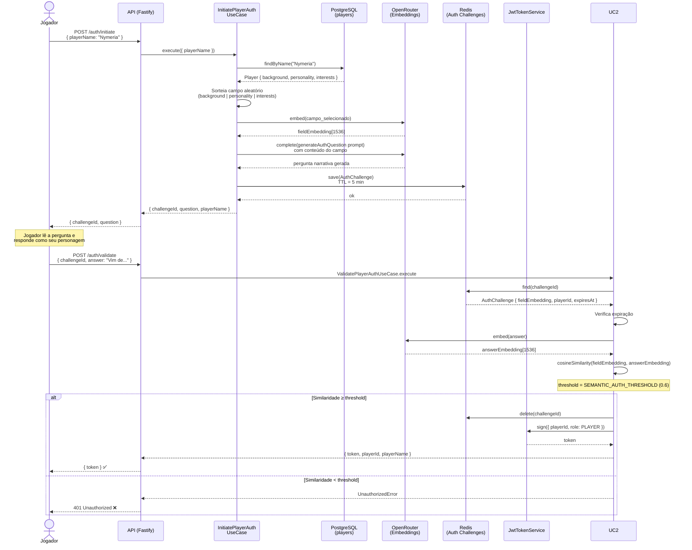
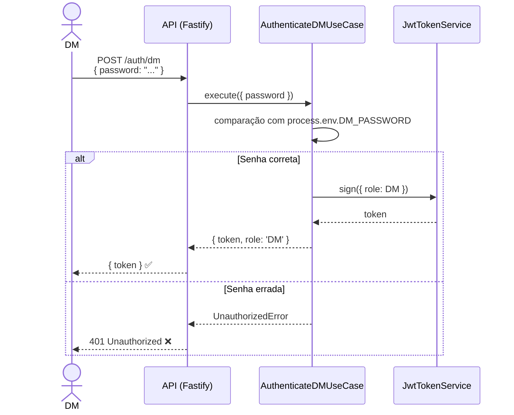
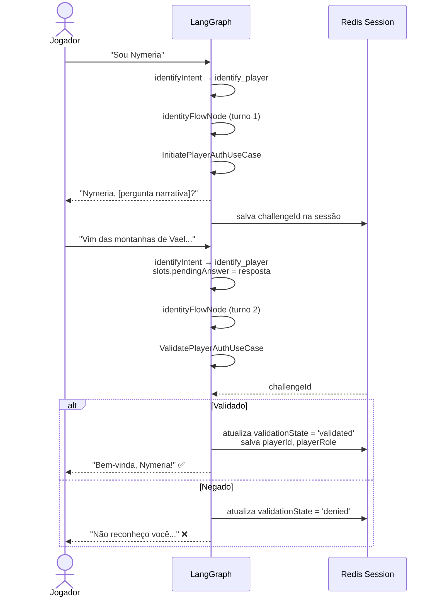

# Fluxo de Autenticação

O sistema tem dois tipos de autenticação: **jogadores** (identidade narrativa via embeddings) e **DM** (senha via variável de ambiente).

## Autenticação de Jogador — Semântica por Embeddings

A autenticação não usa senha. O jogador prova quem é respondendo uma pergunta sobre o background do seu personagem. A resposta é validada por similaridade cossenoidal com o embedding do campo original.



## Autenticação de DM — Senha

O Dungeon Master autentica com uma senha definida em variável de ambiente (`DM_PASSWORD`). Sem banco de dados envolvido.



## Auth Narrativa no LangGraph (identityFlowNode)

Quando o intent é `identify_player` ou `identify_dm`, o grafo gerencia o fluxo de autenticação em **dois turnos**:



## Middleware de Autenticação HTTP

Para rotas protegidas, o `authMiddleware` valida o JWT do header `Authorization: Bearer <token>`:

```
Request → authMiddleware → verifica JWT → injeta request.user { playerId, role }
                        ↓ token inválido → 401 UnauthorizedError
```

O `x-thread-id` header (não cookie) identifica a sessão LangGraph — sem cookies de sessão.

## Segurança Adicional

| Mecanismo | Onde | Propósito |
|-----------|------|-----------|
| `InputSanitizer` | sanitizeNode | Remove padrões perigosos antes de qualquer processamento |
| `PromptInjectionDetector` | sanitizeNode | Detecta tentativas de injeção de prompt |
| `CypherGuardrail` | cypherExecuteNode | Valida queries Cypher antes de executar no Neo4j |
| Rate limiting | Fastify global | `@fastify/rate-limit` — 100 req/min por IP (padrão) |
| Helmet | Fastify global | Headers de segurança HTTP |
