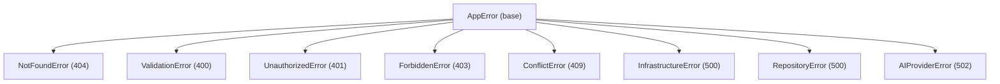

# Clean Architecture — API (`apps/api`)

## Regra de Dependência

Camadas internas nunca dependem das externas. A seta indica a direção permitida de import.

```mermaid
graph TD
    subgraph "🔒 Core (sem dependências externas)"
        domain["domain/<br/>Entidades · Errors · Value Objects"]
        application["application/<br/>Ports (interfaces) · Use Cases"]
    end

    subgraph "🔧 Infraestrutura (implementações concretas)"
        infra["infrastructure/<br/>PostgreSQL · Neo4j · Redis · OpenRouter · Ingestion"]
    end

    subgraph "🌐 Interface (entrada do sistema)"
        http["http/<br/>Controllers Fastify · Schemas Zod · Middleware"]
        graphql["graphql/<br/>Mercurius Schema · Resolvers"]
        graph["graph/<br/>LangGraph StateGraph · Nodes · Router"]
    end

    subgraph "🔌 Composição"
        container["composition/container.ts<br/>Wiring de DI"]
    end

    application -->|"depende de"| domain
    infra -->|"implementa ports de"| application
    http -->|"usa use-cases de"| application
    graph -->|"usa use-cases de"| application
    container -->|"instancia"| infra
    container -->|"instancia"| http
    container -->|"instancia"| graph
```

## Detalhamento por Camada

### `core/domain/` — Entidades e regras de negócio

Sem imports de bibliotecas externas. Define o vocabulário do domínio.

| Arquivo | Conteúdo |
|---------|----------|
| `entities/Character.ts` | Interface do NPC (id, name, role, faction, locationId, metadata) |
| `entities/Player.ts` | Interface do jogador (id, name, class, race, background, personality, interests) |
| `entities/Location.ts` | Interface de localização (id, name, description, region, metadata) |
| `value-objects/Role.ts` | Enum `Role` (PLAYER \| DM) + `JwtPayload` |
| `errors/AppError.ts` | Hierarquia de erros HTTP-aware (ver diagrama de errors) |
| `security/` | `InputSanitizer`, `PromptInjectionDetector`, `CypherGuardrail`, `SecurityGuardrail` |

### `core/application/` — Casos de uso e contratos

Define **o que** o sistema faz, sem saber **como**. Os ports (interfaces) são o contrato entre domínio e infraestrutura.

**Ports (interfaces):**

| Port | Propósito |
|------|-----------|
| `AIProvider` | Completions LLM + embeddings |
| `CharacterRepository` | CRUD de NPCs |
| `PlayerRepository` | CRUD de jogadores |
| `VectorRetriever` | Busca semântica por similaridade |
| `GraphRepository` | Queries no grafo Neo4j |
| `LoreQueryService` | Queries SQL dinâmicas por campos |
| `NpcAffinityRepository` | Rastreamento de afinidade jogador↔NPC |
| `RecommendationFeedbackRepository` | Feedback de recomendações |
| `SessionContextStore` | Sessão por thread_id (Redis) |
| `MemoryEngine` | Memória conversacional (curto + longo prazo) |
| `AuthChallengeStore` | Desafios de auth semântica (Redis TTL) |
| `TokenService` | JWT sign/verify |
| `SemanticAuthService` | Similaridade cossenoidal para auth |

**Use Cases:**

| Use Case | Fluxo |
|----------|-------|
| `GetCharacterUseCase` | Repository → Character ou NotFoundError |
| `RegisterPlayerUseCase` | Valida unicidade → insere → retorna Player |
| `InitiatePlayerAuthUseCase` | Sorteia campo → gera pergunta LLM → embeds → salva desafio Redis |
| `ValidatePlayerAuthUseCase` | Busca desafio → similaridade cossenoidal → JWT |
| `AuthenticateDMUseCase` | Compara senha ENV → JWT role=DM |

### `infrastructure/` — Implementações concretas

Cada implementação cumpre exatamente um port da camada de aplicação.

| Classe | Port implementado | Banco/Serviço |
|--------|-------------------|---------------|
| `PgCharacterRepository` | `CharacterRepository` | PostgreSQL |
| `PgPlayerRepository` | `PlayerRepository` | PostgreSQL |
| `PgNpcAffinityRepository` | `NpcAffinityRepository` | PostgreSQL |
| `PgRecommendationFeedbackRepository` | `RecommendationFeedbackRepository` | PostgreSQL |
| `Neo4jGraphRepository` | `GraphRepository` | Neo4j |
| `PgVectorRetriever` | `VectorRetriever` | PostgreSQL + pgvector |
| `PgLoreQueryService` | `LoreQueryService` | PostgreSQL |
| `PgMemoryEngine` | `MemoryEngine` | PostgreSQL |
| `RedisSessionContextStore` | `SessionContextStore` | Redis |
| `RedisAuthChallengeStore` | `AuthChallengeStore` | Redis |
| `OpenRouterProvider` | `AIProvider` | OpenRouter API |
| `JwtTokenService` | `TokenService` | jsonwebtoken |
| `EmbeddingSemanticAuthService` | `SemanticAuthService` | OpenRouter embeddings |

### `interface/` — Pontos de entrada

Traduz requests externos para chamadas de use-case. Nunca acessa infraestrutura diretamente.

**HTTP (`interface/http/`):**
- `ChatController` → `POST /chat` → invoca LangGraph
- `AuthController` → `POST /auth/*` → use cases de auth
- `authMiddleware` → extrai JWT, injeta `request.user`
- Schemas Zod em `schemas/` — validação na borda

**Graph (`interface/graph/`):**
- `state.ts` — `ValkáriaStateAnnotation` (30+ campos)
- `builder.ts` — compila `StateGraph` com 16 nós e 4 roteadores
- `router.ts` — funções de roteamento condicional
- `nodes/` — 16 nós, cada um com responsabilidade única
- `tools/` — 7 ferramentas LLM registradas no narrativeResponseNode

### `composition/container.ts` — Wiring de DI

Único arquivo que conhece todas as camadas. Instancia na ordem correta:

```
1. ModelConfig (env)
2. OpenRouterProvider (AI)
3. Todos os repositórios e serviços
4. Todos os use cases
5. MemorySaver (checkpointer LangGraph)
6. ValkáriaGraph (com GraphDependencies)
```

## Hierarquia de Erros



O `errorHandler.ts` global captura todas as instâncias de `AppError` e mapeia para respostas HTTP — nenhum controller precisa de try/catch.
