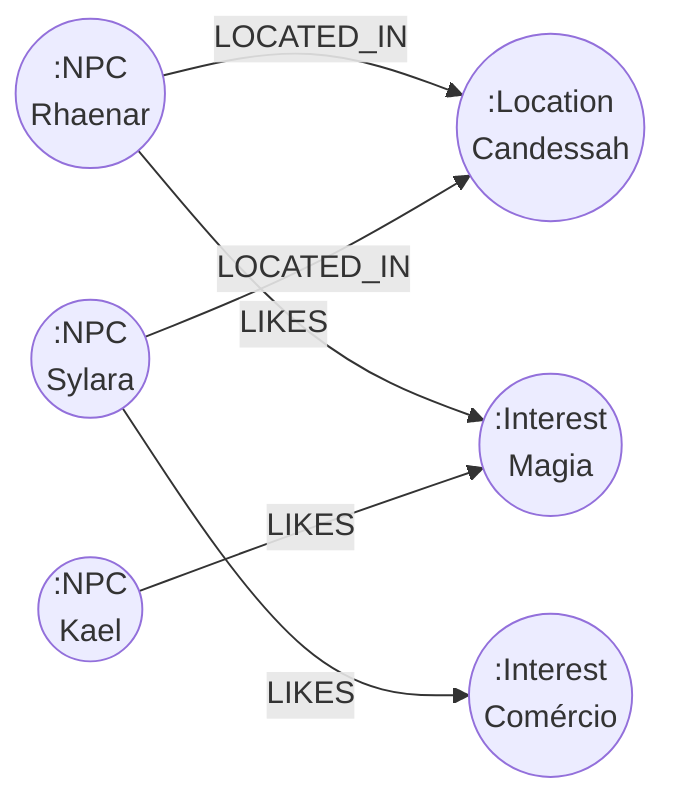

# Schema de Banco de Dados

O projeto usa três bancos de dados com responsabilidades distintas: **PostgreSQL** (relacional + vetorial), **Neo4j** (grafo de relacionamentos) e **Redis** (sessão + cache).

## PostgreSQL — ERD Simplificado

```mermaid
erDiagram
    players {
        uuid id PK
        varchar name UK
        varchar class
        varchar race
        text background
        text personality
        text interests
        timestamptz created_at
        timestamptz updated_at
    }

    locations {
        uuid id PK
        varchar name
        text description
        varchar region
        jsonb metadata
        timestamptz created_at
        timestamptz updated_at
    }

    characters {
        uuid id PK
        varchar name
        text description
        varchar role
        varchar faction
        uuid location_id FK
        jsonb metadata
        timestamptz created_at
        timestamptz updated_at
    }

    npc_affinity {
        uuid id PK
        uuid player_id FK
        varchar npc_name
        varchar level
        integer score
        integer interaction_count
        timestamptz last_interaction
        timestamptz created_at
        timestamptz updated_at
    }

    interaction_history {
        uuid id PK
        uuid player_id FK
        varchar npc_name
        varchar location_name
        varchar intent
        text message_summary
        varchar sentiment
        timestamptz created_at
    }

    player_embeddings {
        uuid id PK
        uuid player_id FK UK
        vector embedding
        float drift_alpha
        integer interaction_count
        timestamptz last_updated
    }

    memory_summaries {
        uuid id PK
        varchar thread_id
        uuid player_id FK
        text summary
        integer turn_count
        timestamptz created_at
        timestamptz updated_at
    }

    conversations {
        uuid id PK
        varchar thread_id UK
        varchar user_id
        jsonb metadata
        timestamptz created_at
        timestamptz updated_at
    }

    langchain_pg_embedding {
        uuid uuid PK
        uuid collection_id
        vector embedding
        text document
        jsonb cmetadata
        varchar custom_id UK
    }

    recommendation_feedback {
        uuid id PK
        uuid player_id FK
        varchar npc_name
        boolean helpful
        timestamptz created_at
    }

    players ||--o{ npc_affinity : "tem afinidades"
    players ||--o{ interaction_history : "tem histórico"
    players ||--|| player_embeddings : "tem embedding"
    players ||--o{ memory_summaries : "tem memórias"
    players ||--o{ recommendation_feedback : "dá feedback"
    characters }o--|| locations : "está em"
```

## Tabelas — Descrição Detalhada

### `characters` — NPCs do universo

| Campo | Tipo | Notas |
|-------|------|-------|
| `role` | varchar | `npc`, `merchant`, `quest_giver`, `enemy`, `ally`, `neutral` |
| `faction` | varchar | `valkaria_order`, `shadow_guild`, `merchant_league`, `free_cities`, `neutral` |
| `metadata` | jsonb | Campos extras do CSV: likes, dislikes, benefits_*, last_demand |

Indexes: `name`, `faction`, `metadata` (GIN)

### `players` — Jogadores autenticados

Armazenam o **perfil narrativo** do personagem — background, personality, interests são usados para auth semântica e geração de embeddings do perfil.

Index adicional: `LOWER(name)` para busca case-insensitive.

### `npc_affinity` — Relacionamento jogador↔NPC

| Campo | Tipo | Notas |
|-------|------|-------|
| `level` | varchar | `none` → `cordial` → `loyal` → `intimate` |
| `score` | integer | 0–100; level é derivado do score |

Constraint: `UNIQUE(player_id, npc_name)` — um registro por par.

### `langchain_pg_embedding` — Armazenamento vetorial RAG

Tabela compatível com LangChain `PGVectorStore`. Armazena embeddings de NPCs e localizações para busca semântica.

- `embedding`: `vector(1536)` — dimensão do `text-embedding-3-small`
- Index: `IVFFlat` com métrica de distância cossenoidal
- `cmetadata`: filtra por tipo de entidade (`type: 'npc' | 'location'`)
- `SCORE_THRESHOLD = 0.3` (similaridade mínima)

### `player_embeddings` — Perfil semântico evolutivo

O embedding do jogador **evolui** a cada interação via alpha-drift:

```
novo_embedding = (1 - drift_alpha) * embedding_atual + drift_alpha * novo_embedding
drift_alpha = 0.15 (padrão)
```

Isso permite que o perfil do jogador reflita seus interesses recentes sem apagar o histórico.

### `memory_summaries` — Memória de longo prazo

O `PgMemoryEngine` mantém uma janela deslizante de até 10 mensagens. Quando atinge 8 mensagens, comprime automaticamente via LLM e armazena o resumo aqui.

### `recommendation_feedback` — Feedback de recomendações

Pesos de feedback são usados pelo `recommendationNode` para ajustar o ranking de NPCs recomendados — NPCs marcados como `helpful=false` têm peso reduzido nas próximas recomendações.

## Neo4j — Modelo de Grafo



**Tipos de nós:** `:NPC`, `:Location`, `:Interest`

**Relacionamentos:**

| Relacionamento | De → Para | Uso |
|----------------|-----------|-----|
| `LOCATED_IN` | NPC → Location | Buscar NPCs por localização |
| `LIKES` | NPC → Interest | Buscar NPCs por interesse compartilhado |
| `ALLIED_WITH` | NPC → NPC | (planejado) Alianças |
| `ENEMY_OF` | NPC → NPC | (planejado) Rivalidades |
| `MEMBER_OF` | NPC → Faction | (planejado) Facções |
| `PART_OF` | Location → Region | (planejado) Regiões |

O `CypherGenerateNode` usa LLM para criar queries Cypher dinamicamente. O `CypherGuardrail` valida as queries antes da execução.

## Redis — Estruturas de Dados

| Chave | Tipo | TTL | Conteúdo |
|-------|------|-----|----------|
| `session:{threadId}` | String (JSON) | 24h | `SessionContext` completo |
| `auth_challenge:{challengeId}` | String (JSON) | 5min | `AuthChallenge` com embedding |
| Rate limit buckets | Hash | Janela configurável | Contadores por IP |

### `SessionContext` (armazenado no Redis)

```typescript
{
  threadId: string
  playerId?: string
  playerName?: string
  currentRole: 'PLAYER' | 'DM' | 'guest'
  validationState: 'pending' | 'challenged' | 'validated' | 'denied'
  challengeId?: string
  affinityContext: AffinitySnapshot[]   // cache de afinidades
  memorySummary?: string                // resumo comprimido
  recentContext: string[]               // últimas mensagens (janela)
  currentLocation?: string
  recommendationContext?: string
  lastUpdated: string
}
```

## Extensões PostgreSQL

| Extensão | Propósito |
|----------|-----------|
| `pgvector` | Tipo `vector`, operadores de distância cossenoidal, índice IVFFlat |
| `uuid-ossp` | Geração de UUIDs (`uuid_generate_v4()`) |

Triggers de `updated_at` automático em: `characters`, `locations`, `conversations`, `players`, `npc_affinity`, `memory_summaries`.
