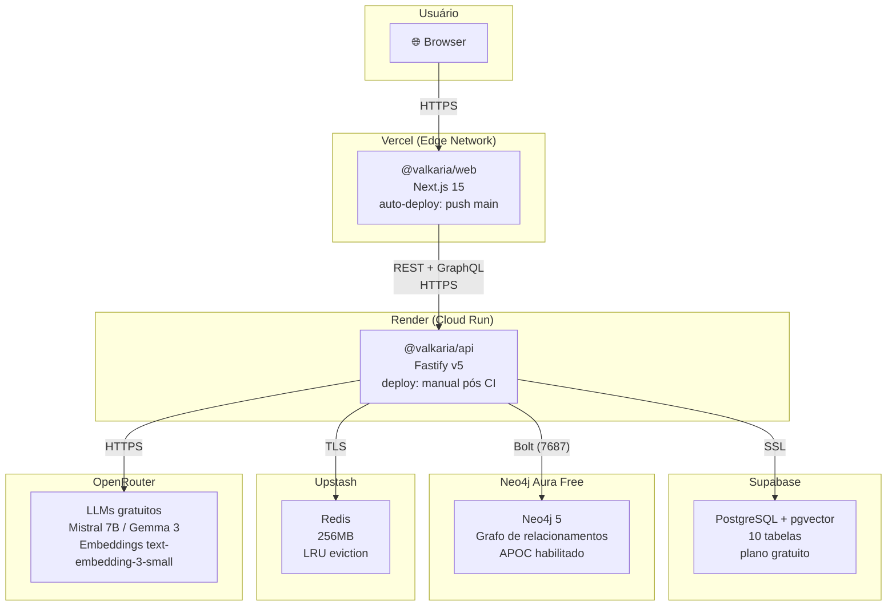
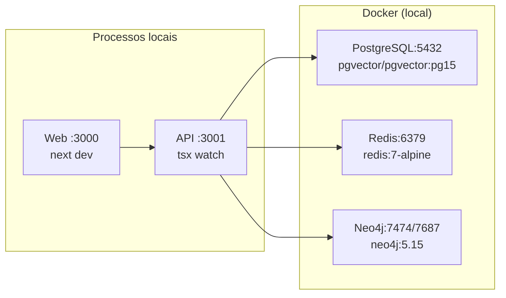

# Topologia de Deploy

## Produção



## Serviços de Produção

| Serviço | Plataforma | Plano | Trigger de Deploy |
|---------|-----------|-------|-------------------|
| Web (`apps/web`) | Vercel | Free | Push automático para `main` via GitHub |
| API (`apps/api`) | Render | Free | Manual pelo dashboard após CI verde |
| PostgreSQL + pgvector | Supabase | Free | — (managed) |
| Neo4j | Neo4j Aura Free | Free | — (managed) |
| Redis | Upstash | Free | — (managed) |
| LLMs | OpenRouter | Pay-per-use | — (API) |

## Comandos de Build

### Render (API)

```bash
pnpm install --frozen-lockfile && \
pnpm --filter @valkaria/shared build && \
pnpm --filter @valkaria/api build
```

O Render injeta `PORT` automaticamente; a API lê via `API_PORT ?? PORT`.

### Vercel (Web)

Configurações no dashboard:
- **Root Directory**: `apps/web`
- **Framework**: Next.js (auto-detectado)
- **Build Command**: `cd ../.. && pnpm --filter @valkaria/shared build && pnpm --filter @valkaria/web build`

## Variáveis de Ambiente por Serviço

### Render (API)

```bash
NODE_ENV=production
DATABASE_URL=postgresql://...supabase.co/...
NEO4J_URI=neo4j+s://...databases.neo4j.io
NEO4J_USER=neo4j
NEO4J_PASSWORD=...
REDIS_URL=rediss://...upstash.io
OPENROUTER_API_KEY=sk-or-...
JWT_SECRET=<32+ chars>
DM_PASSWORD=<8+ chars>
FRONTEND_URL=https://valkaria.vercel.app
```

### Vercel (Web)

```bash
NEXT_PUBLIC_API_URL=https://valkaria-api.onrender.com
NEXT_PUBLIC_GRAPHQL_URL=https://valkaria-api.onrender.com/graphql
```

## Configurações Críticas de Produção

### CORS

`FRONTEND_URL` no Render deve ser a URL exata do Vercel (ex: `https://valkaria.vercel.app`). Sem trailing slash.

### Cookies Cross-Origin

Qualquer `reply.setCookie` em produção requer:
```typescript
{ sameSite: 'none', secure: true }
```

### Sessão

Identificada pelo header `x-thread-id` — sem cookies de sessão. O frontend envia o `threadId` retornado pela primeira resposta do chat.

## Desenvolvimento Local



```bash
# Subir infra
docker compose -f infrastructure/docker/docker-compose.yml up -d

# Rodar apps
pnpm dev
```

URLs de desenvolvimento:
- **Web**: http://localhost:3000
- **API**: http://localhost:3001
- **GraphiQL**: http://localhost:3001/graphql
- **Neo4j Browser**: http://localhost:7474
