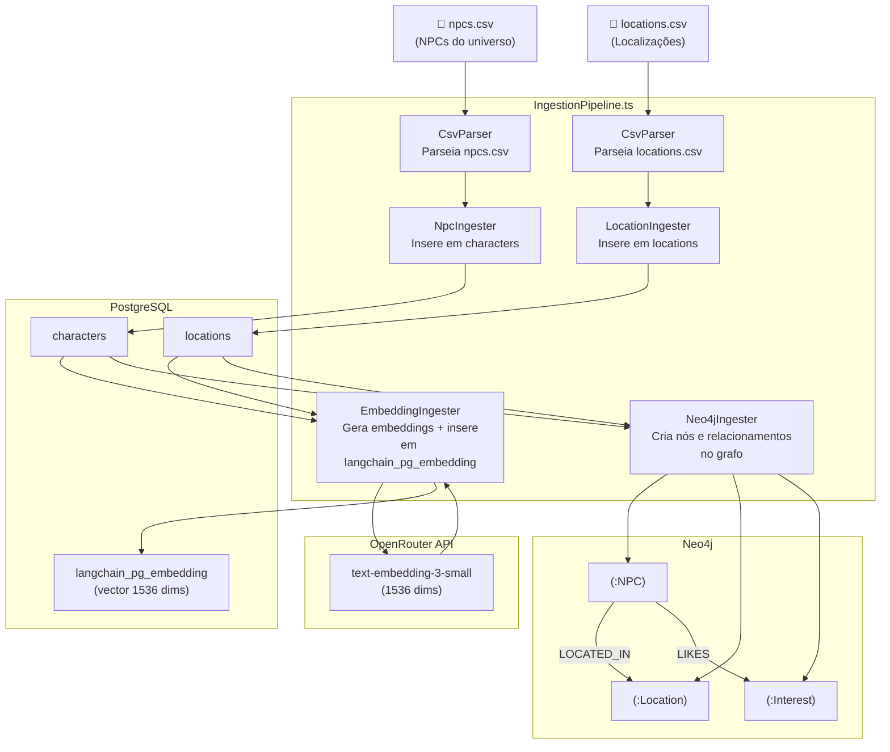

# Pipeline de Ingestão de Dados

O pipeline lê arquivos CSV com dados do universo Valkária e os distribui para os três bancos de dados: PostgreSQL (dados relacionais + embeddings), e Neo4j (grafo de relacionamentos).

## Fluxo Geral



## Etapas Detalhadas

### 1. Parse CSV (`CsvParser.ts`)

Lê e valida os arquivos CSV. Os campos esperados diferem por tipo:

**npcs.csv** — campos relevantes:
- `name`, `description`, `role`, `faction`, `location_name`
- `likes`, `dislikes` (listas separadas por `;`)
- `benefits_cordial`, `benefits_loyal`, `benefits_intimate`
- `last_demand`, `personality`

**locations.csv** — campos relevantes:
- `name`, `region`, `short_description`, `full_description`
- `services`, `honors`
- `npc_names` (lista de NPCs presentes)

### 2. Ingestão Relacional (`NpcIngester` + `LocationIngester`)

Insere ou atualiza (`UPSERT`) no PostgreSQL com `ON CONFLICT DO UPDATE`. A ordem importa: locations primeiro, pois characters referenciam `location_id`.

```sql
-- Exemplo NpcIngester
INSERT INTO characters (id, name, description, role, faction, location_id, metadata)
VALUES ($1, $2, $3, $4, $5,
  (SELECT id FROM locations WHERE LOWER(name) = LOWER($6)),
  $7::jsonb
)
ON CONFLICT (name) DO UPDATE SET ...
```

### 3. Geração de Embeddings (`EmbeddingIngester`)

Para cada NPC e localização, gera um embedding do texto descritivo:

```
texto_npc = "Nome: X. Descrição: Y. Facção: Z. Localização: W. ..."
embedding = OpenRouter.embed(texto_npc)  // text-embedding-3-small, 1536 dims
```

Armazena em `langchain_pg_embedding` com metadata para filtros:
```json
{
  "type": "npc",
  "name": "Rhaenar",
  "faction": "valkaria_order",
  "location": "Candessah"
}
```

### 4. Ingestão no Neo4j (`Neo4jIngester`)

Cria nós e relacionamentos via Cypher:

```cypher
-- Cria NPC
MERGE (n:NPC { name: $name })
SET n.description = $description, n.faction = $faction

-- Cria Location e relaciona
MERGE (l:Location { name: $locationName })
MERGE (n)-[:LOCATED_IN]->(l)

-- Cria Interests e relaciona
MERGE (i:Interest { name: $interest })
MERGE (n)-[:LIKES]->(i)
```

## Executar a Ingestão

```bash
# Pré-requisitos: Docker rodando + .env preenchido

# 1. Subir infraestrutura
docker compose -f infrastructure/docker/docker-compose.yml up -d

# 2. Executar pipeline completo
pnpm --filter @valkaria/api ingest
```

O script `runIngestion.ts` executa as etapas na ordem correta e exibe progresso no console.

## Fontes de Dados

| Arquivo | Tamanho | Conteúdo |
|---------|---------|----------|
| `npcs.csv` | ~32 KB | NPCs do universo Valkária |
| `locations.csv` | ~12 KB | Localizações e regiões |

Os arquivos ficam na raiz do monorepo. Para adicionar novos dados: editar os CSVs e re-executar o pipeline (idempotente via UPSERT).
