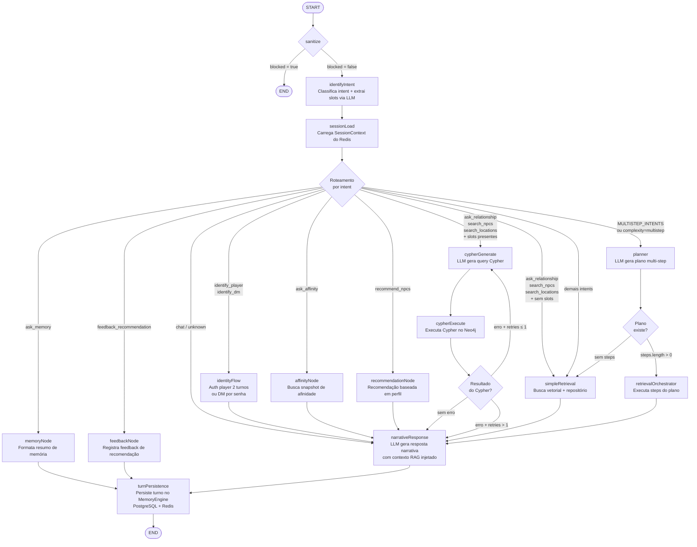

# LangGraph — Fluxo do StateGraph

## Visão Geral

O `ValkáriaGraph` é um `StateGraph` compilado com **16 nós** e **4 roteadores condicionais**. Todo o estado da conversa vive em `ValkáriaStateAnnotation` e é persistido por `thread_id` via `MemorySaver`.

## Fluxo Completo



## Nós — Responsabilidades

| Nó | Tipo | Inputs principais | Outputs principais |
|----|------|-------------------|-------------------|
| `sanitize` | Sync | `message` | `blocked` |
| `identifyIntent` | Async LLM | `message`, `sessionContext` | `intent`, `slots`, `complexity`, `confidence` |
| `sessionLoad` | Async | `playerId`, config.thread_id | `sessionContext` |
| `identityFlow` | Async LLM | `message`, `slots` | `sessionContext`, `playerId`, `playerRole` |
| `simpleRetrieval` | Async | `message`, `intent`, `slots` | `retrievalResults`, `aggregatedContext` |
| `graphRetrieval` | Async | `slots`, `intent` | `retrievalResults`, `aggregatedContext` |
| `cypherGenerate` | Async LLM | `message`, `lastCypherError` | `lastCypherQueries` |
| `cypherExecute` | Async | `lastCypherQueries` | `retrievalResults`, `lastCypherError`, `cypherRetryCount` |
| `planner` | Async LLM | `message`, `slots`, `intent` | `plannerPlan` |
| `retrievalOrchestrator` | Async | `plannerPlan`, `slots` | `retrievalResults`, `aggregatedContext` |
| `affinityNode` | Async | `intent`, `slots`, `playerId` | `retrievalResults`, `aggregatedContext` |
| `memoryNode` | Sync | `sessionContext` | `response` |
| `recommendationNode` | Async | `playerProfile`, `intent`, `slots` | `lastRecommendedNpcs`, `response` |
| `feedbackNode` | Async | `slots`, `lastRecommendedNpcs`, `playerId` | `actionSuccess` |
| `narrativeResponse` | Async LLM | `aggregatedContext`, `retrievalResults`, `intent`, `message` | `response` |
| `turnPersistence` | Async | todo o estado | (efeitos colaterais) |

## State Shape — `ValkáriaStateAnnotation`

```typescript
// ─── Entrada
message: string

// ─── Segurança
blocked: boolean                // sanitize → true encerra imediatamente

// ─── Classificação
intent: Intent | undefined      // 24 intents possíveis
complexity: 'simple' | 'complex' | 'multistep'
confidence: number
requiresRetrieval: boolean
slots: Partial<Slots>           // acumulam entre turnos (reducer merge)

// ─── Sessão e Identidade
sessionContext: SessionContext | undefined
playerRole: Role | undefined
playerId: string | undefined

// ─── Recuperação
retrievalResults: unknown[]
plannerPlan: PlannerPlan | undefined
aggregatedContext: string | undefined
retrievalError: string | undefined

// ─── Pipeline Cypher
lastCypherQueries: Array<{ cypher: string; purpose: string }>
lastCypherError: string | undefined
cypherRetryCount: number

// ─── Resposta
response: string | undefined
lastRecommendedNpcs: string[]

// ─── Resultados de ação (resetados a cada turno)
actionSuccess: boolean | undefined
actionError: string | undefined
actionData: unknown
```

## Intents e Roteamento

| Intent | Rota para | Slots requeridos |
|--------|-----------|-----------------|
| `identify_player` | identityFlow | — |
| `identify_dm` | identityFlow | — |
| `ask_character` | simpleRetrieval | `characterName` |
| `ask_benefits` | simpleRetrieval | `characterName` |
| `ask_relationship` | cypherGenerate ou simpleRetrieval | `characterName` |
| `ask_location` | simpleRetrieval | `locationName` |
| `ask_lore` | simpleRetrieval | `topic` |
| `ask_affinity` | affinityNode | `affinityTarget` |
| `increase_affinity` | planner (multistep) | `affinityTarget` |
| `search_npcs` | cypherGenerate ou simpleRetrieval | — |
| `search_locations` | cypherGenerate ou simpleRetrieval | — |
| `ask_recommendation` | planner (multistep) | — |
| `recommend_npcs` | recommendationNode | — |
| `feedback_recommendation` | feedbackNode | `feedbackSentiment` |
| `ask_memory` | memoryNode | — |
| `chat` | narrativeResponse | — |
| `unknown` | narrativeResponse | — |

**MULTISTEP_INTENTS** (sempre passam pelo planner): `ask_recommendation`, `ask_relationship`, `increase_affinity`

## Slots Disponíveis

| Slot | Tipo | Preenchido por |
|------|------|----------------|
| `characterName` | string | identifyIntent |
| `locationName` | string | identifyIntent |
| `topic` | string | identifyIntent |
| `affinityTarget` | string | identifyIntent |
| `recommendationFilters` | string | identifyIntent |
| `pendingAnswer` | string | identityFlow (2º turno) |
| `feedbackSentiment` | `'positive' \| 'negative'` | identifyIntent |
| `requestedEntity` | `'npc' \| 'location'` | identifyIntent |
| `requestedFields` | string[] | identifyIntent |
| `relationshipTarget` | string | identifyIntent |
| `previousContext` | string | identifyIntent |

## Ferramentas LLM (Tools Registry)

Registradas no `narrativeResponseNode` para chamadas tool-use:

| Ferramenta | Função |
|------------|--------|
| `getNpcByName` | Lookup de personagem por nome |
| `searchLore` | Busca semântica vetorial |
| `getAffinity` | Consulta nível de afinidade |
| `increaseAffinity` | Atualiza score de afinidade |
| `recommendNpc` | Recomendação vetorizada de NPC |
