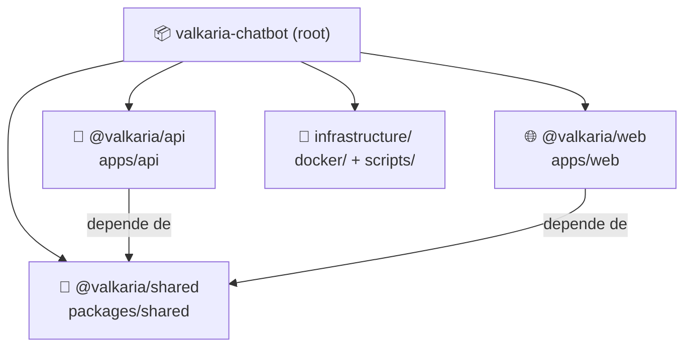

# Estrutura do Monorepo

## Visão Geral

Monorepo gerenciado com **npm workspaces** e **Turborepo**. Três workspaces com fronteiras bem definidas: dois apps independentes e um pacote de tipos compartilhados.



## Estrutura de Diretórios

```
ValkariaChatBot/
├── apps/
│   ├── api/                    @valkaria/api — Backend Fastify + LangGraph
│   │   ├── src/
│   │   │   ├── core/           Domínio + casos de uso (sem dependências externas)
│   │   │   ├── infrastructure/ Implementações concretas (DBs, AI, Auth)
│   │   │   ├── interface/      Controllers HTTP, GraphQL, LangGraph
│   │   │   ├── shared/         Config (env.ts) + prompts versionados
│   │   │   ├── composition/    container.ts — wiring de DI
│   │   │   └── dev/            testGraph.ts — REPL interativo
│   │   └── package.json
│   │
│   └── web/                    @valkaria/web — Frontend Next.js
│       ├── src/
│       │   ├── app/            Rotas Next.js App Router
│       │   ├── components/     Componentes React (chat/, layout/, ui/)
│       │   └── lib/            Apollo Client, AuthContext, utils
│       └── package.json
│
├── packages/
│   └── shared/                 @valkaria/shared — Tipos TypeScript puros
│       ├── src/types/index.ts
│       └── package.json
│
├── infrastructure/
│   ├── docker/
│   │   ├── docker-compose.yml  Postgres + Redis + Neo4j
│   │   └── postgres/init.sql   Schema inicial (10 tabelas + pgvector)
│   └── scripts/
│       ├── seed.ts
│       └── setup.sh
│
├── docs/                       Documentação técnica
│   ├── architecture.md
│   ├── ai-design.md
│   ├── tech-decisions.md
│   └── diagrams/               ← você está aqui
│
├── npcs.csv                    Dados fonte dos NPCs
├── locations.csv               Dados fonte das localizações
├── turbo.json                  Pipeline Turborepo
└── CLAUDE.md                   Guia para o agente Claude Code
```

## Workspaces e Dependências

| Workspace | Nome do pacote | Tipo | Porta |
|-----------|----------------|------|-------|
| `apps/api` | `@valkaria/api` | Node.js ESM | 3001 |
| `apps/web` | `@valkaria/web` | Next.js | 3000 |
| `packages/shared` | `@valkaria/shared` | Biblioteca de tipos | — |

## Pipeline Turborepo (`turbo.json`)

O Turborepo garante ordem de build e cache inteligente:

```
shared:build → api:build
shared:build → web:build

dev (paralelo): api:dev + web:dev
```

Scripts raiz disponíveis:

| Comando | O que faz |
|---------|-----------|
| `npm run dev` | Inicia API (3001) e Web (3000) em paralelo |
| `npm run build` | Build de produção (shared primeiro, depois apps) |
| `npm test` | Vitest em todos os workspaces |
| `npm run typecheck` | `tsc --noEmit` em todos os workspaces |
| `npm run lint` | ESLint em todos os workspaces |
| `npm run ingest -w @valkaria/api` | Executa pipeline de ingestão de dados |
| `npm run graph:dev -w @valkaria/api` | REPL interativo do LangGraph |
